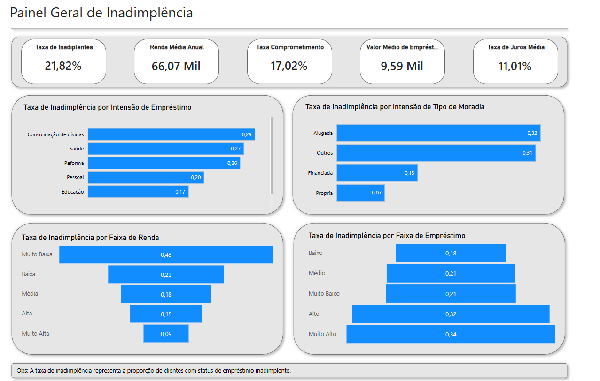

# Análise de Crédito e Inadimplência com Python e Power BI
Este projeto visa criar um Dashboard interativo de crédito que cubra os três pilares principais da análise de risco: perfil do cliente, características do empréstimo e histórico de crédito, permitindo assim, uma visão integrada de inadimplência.

---

## 1. Coleta de dados
- **Origem**: plataforma [Kaggle](https://www.kaggle.com/datasets/laotse/credit-risk-dataset)
- **Acesso**: arquivo `.csv`
- **Tipo de Dados**: dados tabulares de crédito pessoal, contendo informações financeiras e histórico de crédito dos clientes.

---

## 2. ETL (Extração, Transformação e Carga)

### 2.1 - Extração (E)

O dataset foi carregado a partir de um arquivo `.csv` armazenado localmente, utilizando a biblioteca pandas.
A leitura do arquivo foi realizada com o método `pd.read_csv()`, que importa os dados diretamente para um DataFrame.

```
df = pd.read_csv('dashboard_credito_Inadimplencia/data/input/credit_risk_dataset.csv')
```

### 2.2 - Transformação

Nesta etapa, foram aplicadas regras de negócio e tratamentos com foco em padronização, consistência e análise de risco, incluindo:

- Tradução e padronização dos nomes das colunas para o português, facilitando a leitura e interpretação dos dados.
- Criação da variável `nivel_risco`, a partir da classificação original do empréstimo, agrupando os clientes em faixas de risco crescentes (Muito Baixo a Muito Alto).
- Tratamento de valores implausíveis:
    - Idades inferiores a 18 anos ou superiores a 80 anos foram transformadas em valores nulos, seguindo práticas comuns de instituições financeiras.
    - Valores inconsistentes de tempo de emprego (negativos ou incompatíveis com a idade do cliente) também foram tratados como nulos.
- Criação de variáveis derivadas para análise:
    - faixa_renda
    - faixa_emprestimo
    - faixa_hist_credito
    - alerta_comprometimento, indicando alto comprometimento da renda com o empréstimo.
- Padronização de variáveis categóricas, como tipo de moradia, inadimplência arquivada e intenção do empréstimo, traduzindo para português.

### 2.3 - Carga

Após as transformações, o dataset final foi salvo em formato `.csv`, servindo como base para a análise exploratória e para a construção do dashboard.

```
df.to_csv('dashboard_credito_Inadimplencia/data/output/credit_risk_tratado.csv', index=False)
```

---

## 3 - Análise Exploratória de Dados (EDA)

Nesta etapa, foi realizada uma análise exploratória sobre o dataset tratado, com foco na identificação de padrões relacionados à inadimplência e ao risco de crédito.

**Principais insights:**
- A taxa geral de inadimplência da base de dados é relativamente baixa, em torno de 22%, indicando um portfólio predominantemente adimplente.
- Ao analisar a inadimplência por categorias, se observa que as maiores taxas estão associadas a:
    - níveis de risco mais elevados,
    - faixas de renda mais baixas,
    - valores de empréstimo mais altos,
    - clientes que moram em imóveis alugados,
    - empréstimos com finalidade de quitação de dívidas.
- Em relação ao histórico de crédito, as diferenças de inadimplência entre as faixas são menos expressivas. Ainda assim, os históricos mais longos apresentam levemente maiores taxas, o que pode indicar exposição acumulada ao crédito ao longo do tempo.
- O maior comprometimento da renda está concentrado em operações de:
    - risco elevado,
    - baixa renda,
    - alto valor de empréstimo,
    - histórico de crédito curto.
- Clientes que comprometem mais de 40% da renda com o empréstimo apresentam maior probabilidade de inadimplência, reforçando o comprometimento da renda como um importante indicador de risco.

**Correlação entre variáveis numéricas:** <p>
A análise de correlação entre as variáveis numéricas indicou relações fracas na maior parte dos casos. As correlações mais relevantes observadas foram entre idade e histórico de crédito, e entre renda e percentual de comprometimento da renda, o que é consistente com o contexto de crédito.

---

## 4 - Dashboard



Este dashboard foi criado para analisar a inadimplência de clientes de crédito a partir de três pontos principais: perfil do cliente, características do empréstimo e histórico de crédito.

No painel, é possível observar a taxa geral de inadimplência e como ela se comporta quando analisamos fatores como renda, valor do empréstimo, nível de risco, tipo de moradia e finalidade do crédito. A ideia é entender quais perfis apresentam maior risco e quais características estão mais associadas à inadimplência.

O dashboard foi pensado para ser simples de usar e fácil de interpretar, ajudando a identificar padrões que podem apoiar decisões relacionadas à concessão de crédito e gestão de risco.

---

## Autor
Vanessa Costa  
Projeto desenvolvido para fins de estudo e portfólio em análise de dados e risco de crédito.